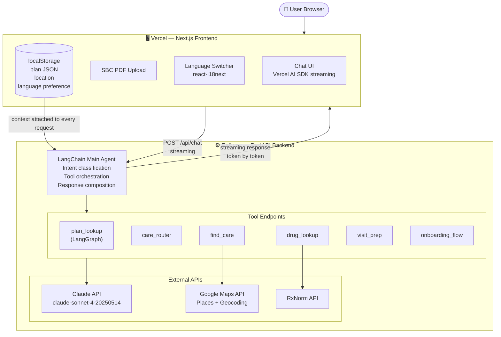
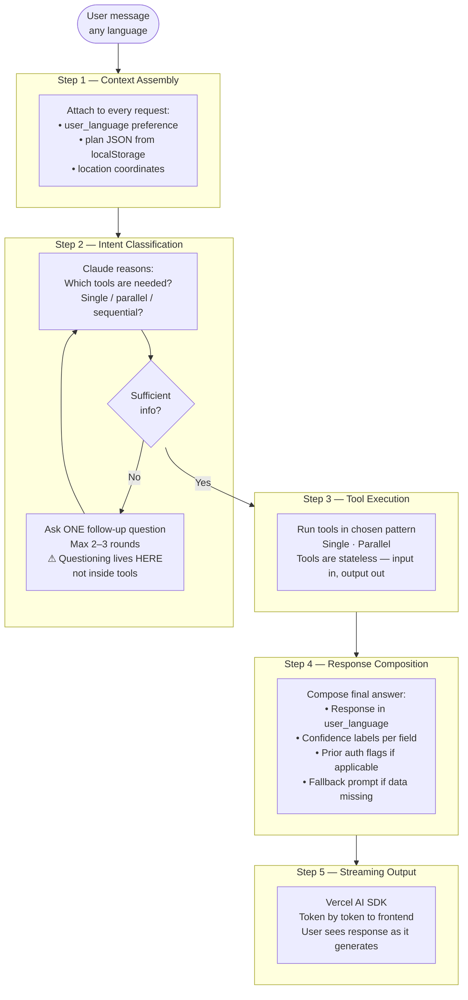
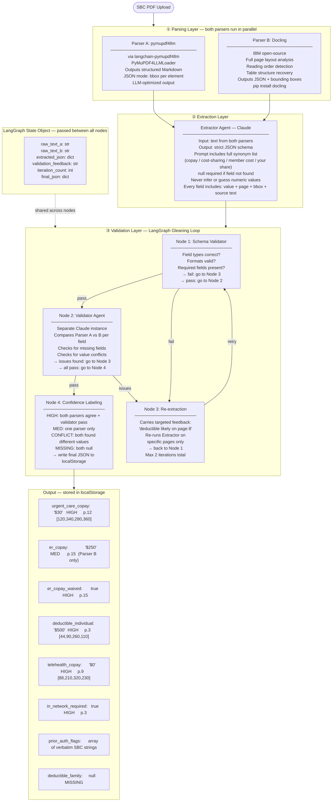
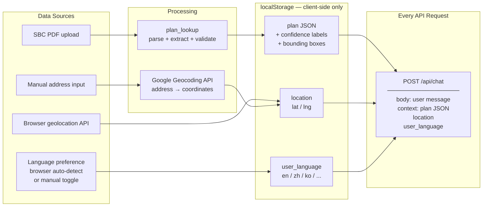
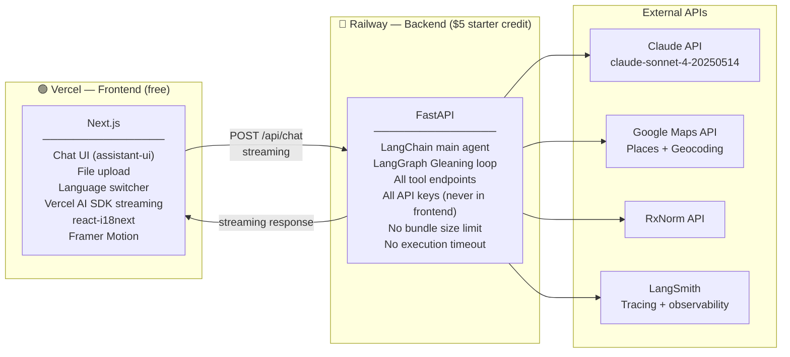

# Birdie — Design Document

> Status legend: ✓ Confirmed | ⚠ TBD — needs discussion

---

## Table of Contents

1. Project Overview ✓
2. Multilingual Architecture ✓
3. System Architecture ✓
4. Plan Data Input ✓
5. Tech Stack ✓
6. Guardrails & Safety ⚠ TBD
7. UI/UX Design ✓
8. Scope & Constraints ✓
9. Implementation Plan ✓
10. Brand & Visual Identity ⚠ TBD (lowest priority)

---

## 1. Project Overview

### 1.1 Problem Statement

International students arriving in the U.S. face a healthcare system built on concepts entirely foreign to most of the world. Deductibles, copays, prior authorization, in-network providers — these are not just unfamiliar terms, they are invisible barriers that stand between a student and the care they need. When illness strikes, students are left deciphering dense insurance documents, searching for nearby clinics with no idea whether they are covered, and receiving medical bills they cannot interpret. For the large portion of international students whose first language is not English, these friction points are compounded further. The result is a community that systematically underutilizes the healthcare benefits they are already paying for.

### 1.2 Target Users

International students studying in the United States, particularly those:

- Newly arrived with no prior experience navigating U.S. healthcare
- Enrolled in university-sponsored insurance plans (SHIP) or marketplace plans
- More comfortable communicating in their native language
- Unfamiliar with concepts like deductibles, copays, prior authorization, and EOBs

### 1.3 Core Value Proposition

Birdie is the knowledgeable friend every international student needs but rarely has — someone who understands both the U.S. healthcare system and the student's specific insurance plan, and can guide them through any healthcare situation in their own language.

Birdie does three things:

**Help them understand** — Insurance plans, medical bills, prescriptions. Students should never be left staring at a document they cannot interpret.

**Help them decide** — Given a specific situation, what is the right next step? Where should they go? What will it likely cost? Does this require prior authorization?

**Help them act** — Concrete next steps, clinic phone numbers, booking links, what to bring, and what to say when they arrive.

### 1.4 What Birdie is NOT

Birdie is a navigation and literacy tool, not a medical provider. It explicitly does not:

- Diagnose symptoms or recommend treatments
- Guarantee insurance coverage or reimbursement outcomes
- Verify real-time in-network status with insurers
- Store or transmit any personal health information to a backend server
- Replace consultation with a licensed physician or insurance representative

---

## 2. Multilingual Architecture

### 2.1 Overview

Multilingual support is not a feature in Birdie — it is a foundational design principle that runs through every layer of the system. A student who is more comfortable in Mandarin should be able to use Birdie entirely in Mandarin, receiving responses, confidence labels, disclaimers, and fallback messages all in the same language. This is achieved through two distinct layers that work together.

### 2.2 UI Layer — Static Text

All fixed UI text including buttons, labels, navigation, error messages, disclaimers, and confidence badge labels is managed through `react-i18next`. This handles:

- Language detection on first load based on browser settings
- Manual language toggle accessible at any point in the UI
- Persistent language preference stored in localStorage

Launch languages: English and Mandarin Chinese. The architecture supports adding Korean, Hindi, Japanese, and others without code changes — only new translation JSON files are needed.

### 2.3 AI Layer — Conversation Language

Claude handles multilingual conversation natively. The user's selected language is passed as a context variable in every API call:

```
system prompt: "You are Birdie... Always respond in {user_language}.
All confidence labels, disclaimers, and fallback messages must also
be in {user_language}."
```

This means:

- User writes in Mandarin → Birdie responds in Mandarin
- Confidence badges render in the correct language
- Fallback messages appear in the user's language
- If the user switches language mid-conversation, the next response reflects the change immediately

### 2.4 Key Design Rule

The two layers must never get out of sync. The `user_language` context variable is the single source of truth, passed to both layers on every render and every API call.

---

## 3. System Architecture

### 3.1 High-Level Overview

Birdie is a web application with a clear separation between frontend and backend. The frontend handles user interaction, streaming display, language switching, and local data storage. The backend handles all agent logic, tool execution, and external API calls. They communicate through a single streaming endpoint at `/api/chat`.



### 3.2 Main Agent Loop

Every user message goes through the same five-step loop:



**Important design decision:** Follow-up questioning when information is insufficient lives in the main agent loop, not inside individual tools. Tools are stateless — they receive inputs and return outputs. The agent decides when it has enough information to call a tool.

### 3.3 Tool Calling Patterns

plan_lookup is not treated as a regular tool call. Its output — the structured plan JSON — is already in localStorage and attached to every request as context. All other tools read from this context directly without needing to call plan_lookup first.

Given this, there are two real calling patterns:

**Single tool:** One clear intent maps to one tool.

| Example | Tool called |
|---|---|
| "What is my urgent care copay?" | plan_lookup context only, no tool call needed |
| "I feel sick, where should I go?" | care_router |
| "Find me an urgent care near me" | find_care |
| "What is this drug?" | drug_lookup |

**Parallel tools:** Two tools whose outputs are independent and can run simultaneously.

| Example | Tools called |
|---|---|
| "I have a fever tonight, where can I go and what will it cost?" | care_router + find_care simultaneously |
| "I just moved here, show me what I need to know" | onboarding_flow (which internally calls care_router + find_care) |

There is no true sequential pattern in this system — the dependency on insurance data is handled through the plan JSON context, not through chained tool calls.

### 3.4 Tool Internal Architecture

#### 3.4.1 plan_lookup ✓

**Purpose:** plan_lookup is the data foundation for the entire system. Every other tool that needs insurance information reads from the structured JSON it produces. It is triggered once when the user uploads their SBC PDF, and the result is stored in localStorage for all subsequent interactions.

**Input:** SBC (Summary of Benefits and Coverage) — a federally mandated 8-page standardized document that every insurance plan must provide. All core cost-sharing fields appear in a consistent format across all insurers, making it the most reliable source for structured extraction.

**Output:** A structured JSON object stored in localStorage, with every field tagged with a confidence label and a source bounding box. This JSON is attached as context to every subsequent API call.

---

**Three layers:**

**Layer 1 — Parsing Layer**

Two parsers run in parallel on the same SBC PDF. Running two parsers simultaneously rather than one is deliberate: no single parser handles all PDF types reliably, and comparing their outputs is the foundation of the confidence labeling system in Layer 3.

Parser A is `pymupdf4llm`, used via the official `langchain-pymupdf4llm` integration package (`pip install langchain-pymupdf4llm`). It is optimized specifically for LLM applications — it outputs structured Markdown that preserves headers, tables, bold and italic formatting, and code blocks, and its JSON export mode outputs bounding box coordinates and layout data for every element on the page. It integrates directly into LangChain as a Document Loader via `PyMuPDF4LLMLoader`.

Parser B is Docling, an IBM open-source library. Its key capability is full page layout analysis — it understands reading order, table structure, and multi-column formatting, which `UnstructuredPDFLoader` can miss. Crucially, Docling outputs bounding box coordinates for every extracted text element, which is what enables Visual Grounding in Layer 2.

Both parsers produce text content tagged with page numbers. Their outputs are passed independently into Layer 2.

---

**Layer 2 — Extraction Layer**

A single Extractor Agent built on Claude receives both parser outputs and produces a strictly structured JSON object. The prompt specifies the complete field schema, a synonym list for each field (because different insurers use different terminology — "copay", "cost-sharing", "member cost", and "your share" all refer to the same concept), and a hard rule: any field that cannot be found with confidence must be set to `null`. The agent is never permitted to infer or guess a numeric value.

Every field in the output JSON includes not just the value but three additional metadata properties — the source page number, the bounding box coordinates from Docling, and the verbatim source text from the original document. This combination of value plus location plus source text is called **Visual Grounding**.

**What Visual Grounding means:** Instead of Birdie saying "your urgent care copay is $30" with no way to verify, every extracted field is anchored back to its exact location in the original document. The output looks like:

```json
"urgent_care_copay": {
  "value": "$30",
  "confidence": "HIGH",
  "page": 12,
  "bbox": [120, 340, 280, 360],
  "source_text": "...copay of $30 per visit for urgent care..."
}
```

This means if a user questions a value, Birdie can point them to the exact page and position in their own SBC to verify. It is the primary mechanism for reducing hallucination risk — not through disclaimers, but through traceable sourcing.

---

**Layer 3 — Validation Layer (LangGraph)**

This layer runs a Gleaning loop — a self-correction pattern where an independent agent reviews the extraction results and triggers re-extraction if it finds gaps or inconsistencies. This loop has three requirements that make LangGraph the right tool: conditional branching (go to re-extraction or confidence labeling depending on the validator's finding), loops (retry up to 2 times), and state that persists across iterations (the iteration count and validator feedback must be readable by every node in the graph). Using plain LangChain chains here would require manual if-else logic and fragile state passing through function arguments.

The loop runs across four nodes. Node 1 (Schema Validator) checks that every field in the JSON has the correct type and format. Node 2 (Validator Agent) is a separate Claude instance that compares Parser A and Parser B outputs field by field, looking for missing values and conflicts between the two parsers. If Node 2 finds issues, it generates targeted feedback — for example "deductible field likely on page 8, second column" — and the loop moves to Node 3 (Re-extraction), which re-runs the Extractor Agent on the specific pages identified, not the entire document. After re-extraction the loop returns to Node 1. The maximum iteration count is 2 — beyond that, unresolved fields are marked MISSING and the user is told to call their insurer. If Node 2 finds no issues, the loop exits to Node 4 (Confidence Labeling), which assigns a label to every field based on the comparison between both parsers and the validator result.

The LangGraph state object passed between all nodes contains: `raw_text_a`, `raw_text_b`, `extracted_json`, `validation_feedback`, `iteration_count`, and `final_json`.

---



---

**Why LangGraph for the Validation Layer:**

The Gleaning loop has three requirements that LangChain chains cannot handle: conditional branching (go to re-extraction or confidence labeling depending on validator result), loops (retry up to 2 times), and state that persists across iterations (the `iteration_count` and `validation_feedback` must be readable by every node). LangGraph is built specifically for stateful, looping agent workflows. Using plain LangChain here would mean writing manual if-else logic and passing state through function arguments — fragile and hard to debug.

---

**Full JSON schema:**

| Field | Type | Description |
|---|---|---|
| `deductible_individual` | string | Annual individual deductible |
| `deductible_family` | string | Annual family deductible |
| `out_of_pocket_max_individual` | string | Annual OOP cap individual |
| `out_of_pocket_max_family` | string | Annual OOP cap family |
| `primary_care_copay` | string | PCP visit copay |
| `specialist_copay` | string | Specialist visit copay |
| `urgent_care_copay` | string | Urgent care copay |
| `er_copay` | string | Emergency room copay |
| `er_copay_waived_if_admitted` | boolean | ER copay waived if admitted inpatient |
| `telehealth_copay` | string | Telehealth visit copay |
| `telehealth_covered` | boolean | Whether telehealth is covered |
| `generic_drug_copay` | string | Tier 1 / generic drug cost |
| `preferred_drug_copay` | string | Tier 2 preferred drug cost |
| `mental_health_copay` | string | Mental health visit copay |
| `in_network_required` | boolean | Whether out-of-network is covered |
| `pcp_referral_required` | boolean | Whether referral is needed for specialist |
| `prior_auth_flags` | string[] | Verbatim SBC text for each prior auth scenario |
| `insurer_phone` | string | Member services phone number |
| `insurer_provider_finder_url` | string | Insurer's in-network provider search URL |

Every field in the output JSON also carries three metadata fields: `confidence` (HIGH / MED / CONFLICT / MISSING), `page` (source page number), and `bbox` (bounding box coordinates from Docling).

---

**Confidence label definitions:**

| Label | Condition | What Birdie does |
|---|---|---|
| HIGH | Both parsers agree + validator passes + bbox exists | Display value directly |
| MED | Only one parser found the value | Display with "please verify with your insurer" |
| CONFLICT | Both parsers found different values | Show both values, link to original document page |
| MISSING | Both parsers returned null | "Not found in your plan — call member services" |

---

**prior_auth handling:**

The SBC "Common Medical Events" table lists care scenarios with prior auth requirements. These are extracted verbatim into `prior_auth_flags`. Birdie does not interpret or expand these rules — the SBC wording is intentionally vague and the full rules exist in a separate Medical Policy document not available publicly. When a user's question involves a care type that matches a prior auth flag, Birdie appends the verbatim SBC text and: "Your plan indicates prior authorization may be required for this type of care. Call the number on your insurance card before scheduling."

#### 3.4.2 care_router ✓

**Purpose:** Given a user's situation, recommend the most appropriate care setting. Makes routing decisions only — never diagnoses conditions or recommends treatments.

**Routing options:** ER, urgent care, telehealth, PCP, pharmacy, mental health services, physical therapy.

**Input:**
```json
{
  "user_message": "string — original user message",
  "extracted_context": {
    "symptom_description": "string",
    "severity": "emergency | urgent | routine",
    "time_sensitivity": "now | today | this_week | flexible",
    "time_of_day": "string"
  },
  "plan_json": "dict | null",
  "user_language": "string"
}
```

**Internal logic — three steps:**

Step 1 is Context Extraction. Claude reads the user message and populates `extracted_context`. This step only structures information — it makes no routing decisions. If the main agent has already asked follow-up questions before calling this tool, the input will already be complete.

Step 2 is Routing Decision. Claude applies the following decision framework:

```
Emergency → ER (regardless of insurance):
  Chest pain, difficulty breathing, loss of consciousness,
  severe allergic reaction, heavy bleeding

Urgent, same day → urgent care or telehealth:
  Fever, minor injury, ear pain, UTI, mild allergic reaction
  If after hours or weekend → prefer telehealth if covered

Can wait → PCP or telehealth:
  Chronic issues, follow-ups, non-acute symptoms

Medication only → pharmacy:
  Mild symptoms, OTC guidance needed

Mental health → mental health services:
  Anxiety, depression, stress, sleep issues
  Routed separately, never mixed with physical symptoms

Musculoskeletal → PT:
  Sports injury, chronic pain, posture issues
  Check plan_json for pcp_referral_required
  If referral required → recommend PCP first
```

Step 3 is Coverage Overlay. For each recommended option, read the corresponding field from plan_json and attach coverage information. Check prior_auth_flags for matching scenarios.

**Output:**
```json
{
  "primary_recommendation": {
    "care_type": "urgent_care | er | telehealth | pcp | pharmacy | mental_health | pt",
    "reason": "string — one sentence explanation",
    "coverage": {
      "copay": "string | null",
      "confidence": "HIGH | MED | MISSING",
      "note": "string"
    },
    "prior_auth_flag": "string | null — verbatim SBC text if applicable"
  },
  "alternative_options": [
    { "care_type": "string", "reason": "string", "coverage": {} }
  ],
  "referral_required": "boolean — true if PT or specialist needs PCP referral first",
  "user_language": "string"
}
```

**Legal boundary:** Every response includes: "This is care navigation guidance only, not medical advice. If you believe you have a medical emergency, call 911 immediately."

---

#### 3.4.3 find_care ✓

**Purpose:** Given a care type and location, return a list of real nearby providers with actionable contact information.

**Input:**
```json
{
  "care_type": "urgent_care | er | pcp | pharmacy | mental_health | pt | telehealth",
  "location": { "lat": "float", "lng": "float" },
  "open_now": "boolean — default true",
  "user_language": "string"
}
```

**Internal logic — two steps:**

Step 1 is Google Maps Places API call. care_type maps to a search keyword:

```python
CARE_TYPE_MAPPING = {
    "urgent_care":    "urgent care clinic",
    "er":             "emergency room hospital",
    "pcp":            "primary care physician clinic",
    "pharmacy":       "pharmacy",
    "mental_health":  "mental health clinic therapist",
    "pt":             "physical therapy clinic",
    "telehealth":     None  # handled separately, see below
}

results = google_maps.places_nearby(
    location=(lat, lng),
    keyword=CARE_TYPE_MAPPING[care_type],
    rank_by="distance",
    open_now=open_now
)
```

Step 2 is result formatting. Extract and format fields from the Places API response. Return maximum 5 results sorted by distance.

**Telehealth special case:** When care_type is "telehealth", skip Google Maps entirely. Return a static response based on plan_json:

```json
{
  "care_type": "telehealth",
  "results": [{
    "name": "Telehealth via your insurance",
    "note": "Log into your insurer's app or website to start a telehealth visit",
    "insurer_url": "plan_json.insurer_provider_finder_url",
    "copay": "plan_json.telehealth_copay",
    "confidence": "plan_json.telehealth_copay.confidence"
  }]
}
```

**Output:**
```json
{
  "care_type": "string",
  "results": [
    {
      "name": "string",
      "address": "string",
      "distance_miles": "float",
      "is_open_now": "boolean",
      "hours_today": "string — e.g. Open until 10pm",
      "phone": "string | null",
      "google_maps_url": "string",
      "booking_url": "string | null",
      "rating": "float | null",
      "rating_count": "int | null",
      "network_status": "verify_required",
      "network_note": "Call to verify if this provider accepts your insurance"
    }
  ],
  "telehealth_fallback": "boolean — true if no results found, suggest telehealth instead",
  "user_language": "string"
}
```

---

#### 3.4.4 drug_lookup ✓ (T1)

**Purpose:** Standardize drug names, check formulary coverage, identify generic alternatives, guide prescription refills.

Input: drug name (natural language), plan_json
Output: standardized name, generic alternatives, coverage status from plan_json, refill guidance

Uses RxNorm API for drug standardization.

---

#### 3.4.5 visit_prep ✓ (T1)

**Purpose:** Generate a pre-visit checklist based on the user's situation and insurance.

Input: care_type, symptom_description, plan_json
Output: what to bring, what to say at check-in, questions to ask the doctor, prior auth reminder if applicable

No external API calls — pure Claude generation.

---

#### 3.4.6 onboarding_flow ✓ (T1)

**Purpose:** After SBC upload, proactively summarize the most important things a user needs to know about their plan, without being asked.

Internally calls plan_lookup (already done), then generates a summary card covering: deductible status, key copays, telehealth availability, nearest urgent care (calls find_care), insurer contact info.

Not a mandatory first step — triggered only when user uploads SBC or explicitly asks for a plan summary.

### 3.5 Data Flow



**Privacy principle:** No personal health information is ever sent to backend storage. The localStorage is the only persistence layer for user data. All data lives on the user's device only.

### 3.6 Deployment Architecture



**Why not Vercel for the backend:** Vercel Python serverless functions have two hard limits that this project exceeds. The bundle size limit (500MB) would be exceeded by LangChain + LangGraph + Docling combined. The execution timeout (10 seconds on free tier, 60 seconds on Pro) is too short for plan_lookup's Gleaning loop which involves multiple sequential Claude API calls and can take 30–90 seconds. Railway has neither constraint and its $5 starter credit is more than sufficient for a 3-day demo.

### 3.7 Observability

LangSmith is attached to the LangChain and LangGraph layers. Every agent run produces a full trace showing:

- Which tools were called and in what order
- Inputs and outputs for each tool call
- Latency per step
- Gleaning loop iterations and validator feedback

During development this is the primary debugging tool. During the demo it provides a live view of agent reasoning.

---

## 4. Plan Data Input ✓

### 4.1 Primary Path — SBC PDF Upload

The Summary of Benefits and Coverage (SBC) is a federally mandated 8-page standardized document that every insurance plan must provide by law. It contains all core cost-sharing fields in a consistent format across all insurers, making it the most reliable and practical input source for plan_lookup.

Users who do not have their SBC on hand are guided to find it:
- **School SHIP (e.g. Northeastern NUSHP):** Download from the school's student health insurance portal
- **Marketplace plans:** Log into healthcare.gov → plan details → documents
- **Employer or other plans:** Log into the insurer's member portal → plan documents

SBC upload is not mandatory on first load. Users can ask general questions immediately. The upload prompt appears persistently in the sidebar. When a question requires plan data and no SBC has been uploaded, Birdie answers with a general response and appends: "Upload your SBC for answers specific to your plan" with an upload button.

### 4.2 Demo Path — Pre-loaded SHIP Template ✓

For demo purposes, Birdie ships with a pre-loaded JSON template based on a real university SHIP (Northeastern NUSHP / Aetna Student Health). Users can select "I'm a Northeastern student" to skip the upload step entirely and begin the demo immediately with realistic data.

This allows the demo to run smoothly without requiring a real SBC upload, while still showcasing the full plan_lookup output including confidence labels and prior auth flags.

### 4.3 Plan Context Design ✓

The plan JSON from either path is stored in localStorage under the key `birdie_plan_context`. It is never sent to the backend for storage. On every API request, the frontend reads this value from localStorage and attaches it to the request body.

If `birdie_plan_context` is null (no SBC uploaded), the backend receives `plan_json: null` and all tools gracefully degrade to general guidance mode with an upload prompt in the response.

---

## 5. Tech Stack ✓

| Layer | Technology | Reason |
|---|---|---|
| Frontend | Next.js + Tailwind CSS | Zero-config Vercel deployment, mobile-responsive |
| Chat UI | assistant-ui | Open-source ChatGPT-style React UI, streaming built-in, themeable |
| Streaming | Vercel AI SDK | Handles Claude streaming from FastAPI backend via Data Stream Protocol |
| Multilingual UI | react-i18next | Standard React i18n, dynamic language switching, localStorage persistence |
| Welcome animation | Framer Motion | Logo fly-in + tagline fade-in on first load |
| Backend | FastAPI | Async-native, lightweight, deploys as Vercel serverless function |
| Main agent | LangChain | Linear pipeline, tool calling, no over-engineering |
| Gleaning loop | LangGraph | Stateful loop with conditional branching — required for plan_lookup validation |
| PDF parsing A | pymupdf4llm via langchain-pymupdf4llm | LLM-optimized, Markdown + bbox output, native LangChain integration |
| PDF parsing B | Docling | Complex layouts, tables, multi-column, native bbox |
| Model | Claude (claude-sonnet-4-20250514) | Unified across all tools — multilingual, document understanding, tool calling |
| Provider search | Google Maps Places API | Real clinic data, open_now filter, phone, booking links |
| Geocoding | Google Maps Geocoding API | Address → coordinates fallback when user declines location |
| Drug lookup | RxNorm API | Free, standardizes drug names, generic alternatives |
| Observability | LangSmith | Native LangChain tracing, free tier sufficient |
| Deployment | Vercel (frontend) + Railway (backend) | Vercel is optimal for Next.js frontend. Railway is required for FastAPI backend because: (1) Vercel's Python serverless function bundle limit (~500MB) would be exceeded by LangChain + LangGraph + Docling combined; (2) Vercel's function execution timeout (10s free / 60s Pro) is too short for plan_lookup's Gleaning loop which can take 30–90s; (3) Railway has no size limit, no timeout limit, and no sleep/cold-start on the $5 starter credit |

---

## 6. Guardrails & Safety

### 6.1 CLAUDE.md Rules

The following rules are defined in CLAUDE.md and applied to every agent call:

- Never diagnose medical conditions or recommend specific treatments
- Never state definitively that a provider is in-network — always append "call to verify"
- Never guess or infer insurance values — output null if not found in SBC
- Never store any user health information in backend
- Always respond in the user's selected language
- Always append a disclaimer when discussing care routing: "This is navigation guidance only, not medical advice. Call 911 for emergencies."
- When confidence is MISSING, always direct user to call their insurer's member services number

### 6.2 Confidence Label System ✓

Defined in 3.4.1. Applied to every field extracted by plan_lookup and surfaced in every response that references insurance data.

### 6.3 care_router Legal Boundary ✓

care_router routes to care settings, never to diagnoses. The word "diagnosis" and phrases like "you have" or "you might have" are explicitly prohibited in care_router output. Every care_router response ends with the emergency disclaimer.

### 6.4 Fallback Strategy

| Situation | Birdie response |
|---|---|
| Tool call fails | Graceful error message in user language, suggest calling insurer directly |
| plan_json is null | General guidance + "Upload your SBC for plan-specific answers" |
| Google Maps returns no results | Suggest telehealth as alternative, provide insurer provider finder URL |
| Field confidence is MISSING | "This information was not found in your plan. Call [insurer_phone] to confirm." |
| care_type is emergency | Skip all tool calls, immediately output 911 instruction |

### 6.5 Data Privacy ✓

No PHI stored in backend. localStorage only. Stateless by design. SBC PDF is processed in memory and immediately discarded after plan_lookup completes — only the structured JSON is stored in localStorage.

---

## 7. UI/UX Design ✓

### 7.1 Framework

Built on `assistant-ui` (open-source ChatGPT-style React library) with Birdie brand theming applied via Tailwind CSS. Deployed as a Next.js app.

Bootstrap command:
```bash
npx create-next-app --example \
  https://github.com/vercel-labs/ai-sdk-preview-python-streaming \
  birdie
```

Then install assistant-ui on top:
```bash
npx assistant-ui@latest add
```

### 7.2 Page Structure

**Welcome Screen** (shown on first load, disappears after 2 seconds or on tap):
- Birdie logo with fly-in animation (Framer Motion)
- Tagline fade-in: "Your healthcare guide in the US"
- Two CTAs: "Upload my insurance plan" and "Ask a question"
- Language toggle in top-right corner

**Chat Screen** (main interface):
- Top bar: Birdie logo + language toggle + SBC upload status indicator (green dot if uploaded)
- Left sidebar (collapsible on mobile): SBC upload area + plan summary card if uploaded
- Center: assistant-ui chat interface with Birdie green color theme
- Bottom: input field with 3 quick-reply suggestion chips that change contextually
- Provider results render as cards inside the chat, not as separate pages

### 7.3 Provider Result Card

Each clinic from find_care renders as an inline card in the chat:

```
┌─────────────────────────────────────┐
│ UW Medical Center Urgent Care       │
│ ⭐ 4.2 (180 reviews) · 0.8 mi       │
│ 🟢 Open until 10pm                  │
│ 123 Main St, Seattle WA             │
│                                     │
│ ⚠ Call to verify insurance coverage │
│                                     │
│  [📞 Call]    [🗺 Get Directions]   │
└─────────────────────────────────────┘
```

"Get Directions" opens Google Maps in a new browser tab. "Call" triggers a `tel:` link.

### 7.4 Language Toggle

Persistent button in top-right. Cycles through available languages (EN / 中文 at launch). Switching language immediately re-renders all static UI text via react-i18next and sets `user_language` context for all subsequent AI responses.

### 7.5 Confidence Label Display

Confidence labels appear inline in Birdie's responses as small colored pills:

- ✓ Confirmed (green pill) — HIGH
- ~ Likely — verify (amber pill) — MED
- ⚠ Conflict found (red pill) — CONFLICT
- — Not in your plan (gray pill) — MISSING

---

## 8. Scope & Constraints ⚠ TBD

### 8.1 In Scope (demo by March 26)

T0 — must ship:
- plan_lookup with full three-layer architecture
- care_router with all 7 routing options and coverage overlay
- find_care with Google Maps integration and provider cards
- Welcome screen with animation
- Chat interface (assistant-ui)
- SBC upload and plan context system
- Language toggle (EN + Mandarin)
- Deployed to Vercel with public URL

T1 — ship if time allows:
- drug_lookup
- visit_prep
- onboarding_flow

### 8.2 Out of Scope

- Real-time in-network verification (requires insurer API partnerships)
- Appointment booking (requires EHR/Epic integration + HIPAA BAA)
- User accounts and authentication
- Persistent chat history across sessions
- Mobile native app
- Support for insurance plans other than SHIP for demo

### 8.3 Known Risks

| Risk | Mitigation |
|---|---|
| Google Maps returns no results for care type | Telehealth fallback always available |
| SBC format is unusual and parsers fail | Pre-loaded SHIP template ensures demo works regardless |
| Claude API latency too high for demo | Streaming output means user sees response immediately, latency is hidden |
| plan_lookup Gleaning loop times out | Hard cap at 2 iterations, always returns best available result |

---

## 9. Implementation Plan ✓

Deadline: March 26 (3 days from now)

| Day | Focus | Deliverables |
|---|---|---|
| Day 1 (today) | Setup + plan_lookup | Repo init, CLAUDE.md, project scaffold from Vercel template, plan_lookup full implementation with LangGraph Gleaning loop |
| Day 2 | Core tools + frontend | care_router + find_care implementation, frontend chat interface with assistant-ui, SBC upload, language toggle |
| Day 3 | Polish + deploy | Welcome animation, provider cards, Vercel frontend deploy + Railway backend deploy, end-to-end demo flow, demo script rehearsal |

**Day 1 priorities in order:**
1. Create project folder, write CLAUDE.md and birdie_design_doc.md
2. Scaffold project structure with Claude Code (frontend + backend)
3. Implement plan_lookup parsing layer (pymupdf4llm + Docling)
4. Implement plan_lookup extraction layer (Claude + JSON schema)
5. Implement LangGraph Gleaning loop
6. Test with real Northeastern SHIP SBC PDF

**Demo script (main flow to rehearse):**
1. Open birdie URL, welcome animation plays
2. Select "I'm a Northeastern student" — plan loads instantly
3. Ask: "I have a fever, it's 10pm, what should I do?"
4. Birdie routes to urgent care + telehealth, shows coverage from SHIP plan
5. Birdie shows 3 nearby urgent care clinics as cards
6. Click "Get Directions" — Google Maps opens
7. Ask: "What's my urgent care copay?"
8. Birdie answers instantly from plan context with HIGH confidence label
9. Switch language to 中文 — Birdie re-answers in Mandarin

---

## 10. Brand & Visual Identity ⚠ TBD (lowest priority)

### 10.1 Logo

Generate via Midjourney with prompt: "minimal bird logo, teal green #2D9E7A, friendly, healthcare navigation, flat design, svg style, no text"

### 10.2 Color Palette

Primary: `#2D9E7A` (Birdie Green)
Secondary: `#5BC4A0` (Mint)
Background: `#F9F7F4` (Off-white)
Accent warm: `#FFF3E0`

### 10.3 Animation

Welcome screen animation via Framer Motion. Logo flies in from bottom, tagline fades in 0.5s later. Total duration 1.5s. Claude Code prompt: "Add a Framer Motion welcome animation: logo slides up from y:40 to y:0 with opacity 0→1 over 0.6s, tagline fades in after 0.3s delay."
